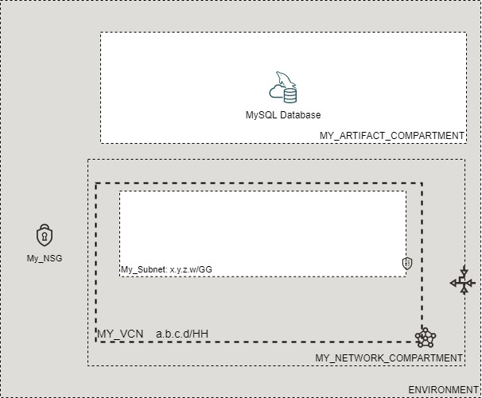

# OCI Cloud Bricks: MySQL Database

[](https://img.shields.io/badge/license-UPL-green) [](https://sonarcloud.io/dashboard?id=oracle-devrel_terraform-oci-cloudbricks-mysql-database)

## Introduction
The following brick enables you to create MySQL Database Systems in either HA or not.

## Reference Architecture
The following is the reference architecture associated to this brick



### Prerequisites
- Pre-baked Artifact and Network Compartments

# Sample tfvars file
```shell
########## SAMPLE TFVAR FILE ##########
######################################## PROVIDER SPECIFIC VARIABLES ######################################
region       = "re-region-1"
tenancy_ocid = "ocid1.tenancy.oc1..aaaaaaaaabcdefg"
user_ocid    = "ocid1.user.oc1..aaaaaaaahijklm"
fingerprint  = "fo:oo:ba:ar:ba:ar"
######################################## PROVIDER SPECIFIC VARIABLES ######################################
######################################## ARTIFACT SPECIFIC VARIABLES ######################################
mysql_instance_compartment_name                 = "MY_ARTIFACT_COMPARTMENT"
mysql_network_compartment_name                  = "MY_NETWORK_COMPARTMENT"
vcn_display_name                                = "MY_VCN"
network_subnet_name                             = "MY_SUBNET"
mysql_db_system_admin_username                  = "MY_ADMIN_USERNAME"
mysql_db_system_admin_password                  = "MY_ADMIN_PASSWORD"
mysql_db_system_availability_domain             = "aBCD:RE-REGION-1-AD-1"
mysql_shape_name                                = "MySQL.VM.Standard.E3.1.8GB"
mysql_db_system_backup_policy_is_enabled        = true
mysql_db_system_backup_policy_retention_in_days = "7"
mysql_db_system_backup_policy_window_start_time = "02:30"
mysql_db_system_data_storage_size_in_gb         = "50"
mysql_db_system_description                     = "MY_DATABASE_DESCRIPTION"
mysql_db_system_display_name                    = "MY_DISPLAY_NAME"
mysql_db_system_fault_domain                    = "FAULT-DOMAIN-1"
mysql_db_system_hostname_label                  = "MY_DATABASE_LABEL"
mysql_db_system_is_highly_available             = true
mysql_db_system_maintenance_window_start_time   = "SUNDAY 14:30"
mysql_db_system_port                            = "3306"
mysql_db_system_port_x                          = "33060"
######################################## ARTIFACT SPECIFIC VARIABLES ######################################
########## SAMPLE TFVAR FILE ##########
```

### Variable specific considerations
- When using HA variable `mysql_db_system_availability_domain` is used as the preferred region but others will still be used in the event of outage.
- If variable `mysql_db_system_is_highly_available` is set to true, the same mysql shape is deployed in each availability domain.
- If variable `mysql_db_system_backup_policy_is_enabled` is set to false `mysql_db_system_backup_policy_retention_in_days` and `mysql_db_system_backup_policy_window_start_time` are ignored and don't need to be defined.

---
### Sample provider
The following is the base provider definition to be used with this module

```shell
terraform {
  required_version = ">= 0.13.5"
}
provider "oci" {
  region       = var.region
  tenancy_ocid = var.tenancy_ocid
  user_ocid        = var.user_ocid
  fingerprint      = var.fingerprint
  private_key_path = var.private_key_path
  disable_auto_retries = "true"
}

provider "oci" {
  alias        = "home"
  region       = data.oci_identity_region_subscriptions.home_region_subscriptions.region_subscriptions[0].region_name
  tenancy_ocid = var.tenancy_ocid  
  user_ocid        = var.user_ocid
  fingerprint      = var.fingerprint
  private_key_path = var.private_key_path
  disable_auto_retries = "true"
}
```

## Variable documentation
## Requirements

No requirements.

## Providers

| Name | Version |
|------|---------|
| <a name="provider_oci"></a> [oci](#provider\_oci) | 4.40.0 |

## Modules

No modules.

## Resources

| Name | Type |
|------|------|
| [oci_mysql_mysql_db_system.DBSystem](https://registry.terraform.io/providers/hashicorp/oci/latest/docs/resources/mysql_mysql_db_system) | resource |
| [oci_core_subnets.SUBNET](https://registry.terraform.io/providers/hashicorp/oci/latest/docs/data-sources/core_subnets) | data source |
| [oci_core_vcns.VCN](https://registry.terraform.io/providers/hashicorp/oci/latest/docs/data-sources/core_vcns) | data source |
| [oci_identity_compartments.COMPARTMENTS](https://registry.terraform.io/providers/hashicorp/oci/latest/docs/data-sources/identity_compartments) | data source |
| [oci_identity_compartments.NWCOMPARTMENTS](https://registry.terraform.io/providers/hashicorp/oci/latest/docs/data-sources/identity_compartments) | data source |

## Inputs

| Name | Description | Type | Default | Required |
|------|-------------|------|---------|:--------:|
| <a name="input_fingerprint"></a> [fingerprint](#input\_fingerprint) | API Key Fingerprint for user\_ocid derived from public API Key imported in OCI User config | `any` | n/a | yes |
| <a name="input_mysql_db_system_admin_password"></a> [mysql\_db\_system\_admin\_password](#input\_mysql\_db\_system\_admin\_password) | (Required) The password for the administrative user. The password must be between 8 and 32 characters long, and must contain at least 1 numeric character, 1 lowercase character, 1 uppercase character, and 1 special (nonalphanumeric) character. | `any` | n/a | yes |
| <a name="input_mysql_db_system_admin_username"></a> [mysql\_db\_system\_admin\_username](#input\_mysql\_db\_system\_admin\_username) | (Required) The username for the administrative user. | `any` | n/a | yes |
| <a name="input_mysql_db_system_availability_domain"></a> [mysql\_db\_system\_availability\_domain](#input\_mysql\_db\_system\_availability\_domain) | (Required) The availability domain on which to deploy the Read/Write endpoint. This defines the preferred primary instance. In a failover scenario, the Read/Write endpoint is redirected to one of the other availability domains and the MySQL instance in that domain is promoted to the primary instance. This redirection does not affect the IP address of the DB System in any way. For a standalone DB System, this defines the availability domain in which the DB System is placed. | `any` | n/a | yes |
| <a name="input_mysql_db_system_backup_policy_is_enabled"></a> [mysql\_db\_system\_backup\_policy\_is\_enabled](#input\_mysql\_db\_system\_backup\_policy\_is\_enabled) | Boolean that defines if either backup is enabled or not | `bool` | `false` | no |
| <a name="input_mysql_db_system_backup_policy_retention_in_days"></a> [mysql\_db\_system\_backup\_policy\_retention\_in\_days](#input\_mysql\_db\_system\_backup\_policy\_retention\_in\_days) | The number of days automated backups are retained. | `any` | n/a | yes |
| <a name="input_mysql_db_system_backup_policy_window_start_time"></a> [mysql\_db\_system\_backup\_policy\_window\_start\_time](#input\_mysql\_db\_system\_backup\_policy\_window\_start\_time) | The start of a 30-minute window of time in which daily, automated backups occur. This should be in the format of the Time portion of an RFC3339-formatted timestamp. Any second or sub-second time data will be truncated to zero. At some point in the window, the system may incur a brief service disruption as the backup is performed. | `any` | n/a | yes |
| <a name="input_mysql_db_system_data_storage_size_in_gb"></a> [mysql\_db\_system\_data\_storage\_size\_in\_gb](#input\_mysql\_db\_system\_data\_storage\_size\_in\_gb) | Initial size of the data volume in GiBs that will be created and attached. | `any` | n/a | yes |
| <a name="input_mysql_db_system_description"></a> [mysql\_db\_system\_description](#input\_mysql\_db\_system\_description) | User-provided data about the DB System. | `any` | n/a | yes |
| <a name="input_mysql_db_system_display_name"></a> [mysql\_db\_system\_display\_name](#input\_mysql\_db\_system\_display\_name) | The user-friendly name for the DB System. It does not have to be unique. | `any` | n/a | yes |
| <a name="input_mysql_db_system_fault_domain"></a> [mysql\_db\_system\_fault\_domain](#input\_mysql\_db\_system\_fault\_domain) | The fault domain on which to deploy the Read/Write endpoint. This defines the preferred primary instance. | `any` | n/a | yes |
| <a name="input_mysql_db_system_hostname_label"></a> [mysql\_db\_system\_hostname\_label](#input\_mysql\_db\_system\_hostname\_label) | The hostname for the primary endpoint of the DB System. Used for DNS. The value is the hostname portion of the primary private IP's fully qualified domain name (FQDN) (for example, dbsystem-1 in FQDN dbsystem-1.subnet123.vcn1.oraclevcn.com). Must be unique across all VNICs in the subnet and comply with RFC 952 and RFC 1123. | `any` | n/a | yes |
| <a name="input_mysql_db_system_is_highly_available"></a> [mysql\_db\_system\_is\_highly\_available](#input\_mysql\_db\_system\_is\_highly\_available) | Boolean that describes if either HA is enabled or not | `bool` | `false` | no |
| <a name="input_mysql_db_system_maintenance_window_start_time"></a> [mysql\_db\_system\_maintenance\_window\_start\_time](#input\_mysql\_db\_system\_maintenance\_window\_start\_time) | (Required) (Updatable) The start of the 2 hour maintenance window. This string is of the format: {day-of-week} {time-of-day}. {day-of-week} is a case-insensitive string like mon, tue, etc. {time-of-day} is the Time portion of an RFC3339-formatted timestamp. Any second or sub-second time data will be truncated to zero. | `any` | n/a | yes |
| <a name="input_mysql_db_system_port"></a> [mysql\_db\_system\_port](#input\_mysql\_db\_system\_port) | (Optional) The port for primary endpoint of the DB System to listen on. | `string` | `"3306"` | no |
| <a name="input_mysql_db_system_port_x"></a> [mysql\_db\_system\_port\_x](#input\_mysql\_db\_system\_port\_x) | (Optional) The TCP network port on which X Plugin listens for connections. This is the X Plugin equivalent of port. | `string` | `"33060"` | no |
| <a name="input_mysql_instance_compartment_name"></a> [mysql\_instance\_compartment\_name](#input\_mysql\_instance\_compartment\_name) | Compartment where MySQL Instance will be created | `any` | n/a | yes |
| <a name="input_mysql_network_compartment_name"></a> [mysql\_network\_compartment\_name](#input\_mysql\_network\_compartment\_name) | Compartment where the network of MySQL artifact is | `any` | n/a | yes |
| <a name="input_mysql_shape_name"></a> [mysql\_shape\_name](#input\_mysql\_shape\_name) | (Required) The name of the shape. The shape determines the resources allocated. CPU cores and memory for VM shapes; CPU cores, memory and storage for non-VM (or bare metal) shapes. To get a list of shapes, use the ListShapes operation. | `any` | n/a | yes |
| <a name="input_network_subnet_name"></a> [network\_subnet\_name](#input\_network\_subnet\_name) | Defines the subnet display name where this resource will be created at | `any` | n/a | yes |
| <a name="input_region"></a> [region](#input\_region) | Target region where artifacts are going to be created | `any` | n/a | yes |
| <a name="input_tenancy_ocid"></a> [tenancy\_ocid](#input\_tenancy\_ocid) | OCID of tenancy | `any` | n/a | yes |
| <a name="input_user_ocid"></a> [user\_ocid](#input\_user\_ocid) | User OCID in tenancy. Currently hardcoded to user denny.alquinta@oracle.com | `any` | n/a | yes |
| <a name="input_vcn_display_name"></a> [vcn\_display\_name](#input\_vcn\_display\_name) | VCN Display name to execute lookup | `any` | n/a | yes |

## Outputs

| Name | Description |
|------|-------------|
| <a name="output_mysql_db_system"></a> [mysql\_db\_system](#output\_mysql\_db\_system) | MySQL Database DBSystem |

## Contributing
This project is open source.  Please submit your contributions by forking this repository and submitting a pull request!  Oracle appreciates any contributions that are made by the open source community.

## License
Copyright (c) 2021 Oracle and/or its affiliates.

Licensed under the Universal Permissive License (UPL), Version 1.0.

See [LICENSE](LICENSE) for more details.
